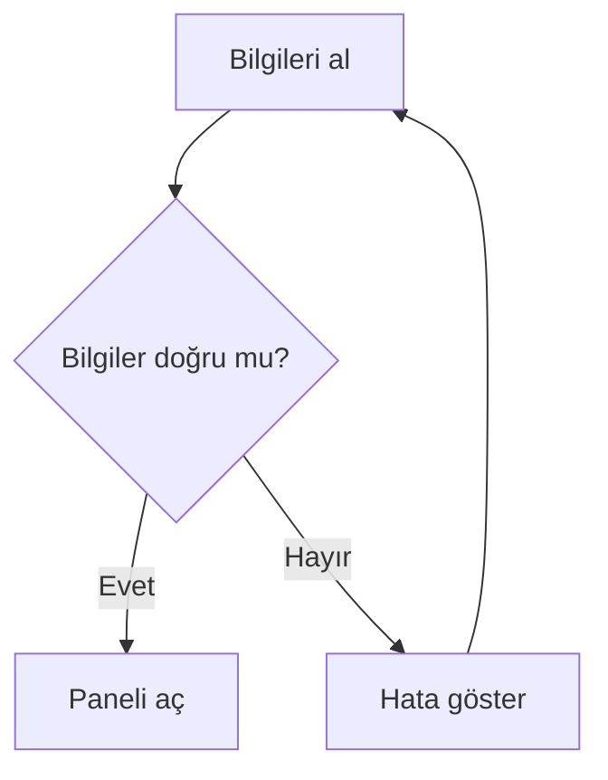
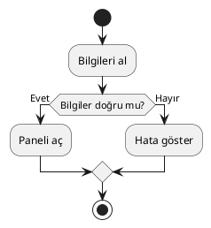

Bir yazılım projesini anlatırken bazen yüz satır koddan daha etkili olan şey, birkaç kutu ve oktur. Akış şemaları; algoritmaları, iş süreçlerini ve sistem davranışlarını görünür hâle getirir. Peki bu şemaları fareyle mi çizmeliyiz, kodla mı üretmeliyiz? İşte bu noktada draw.io, Mermaid ve PlantUML sahneye çıkıyor.

``
## Akış şemasının temel mantığı

Akış şeması, bir süreci **düğümler** ve bu düğümler arasındaki **yönlendirilmiş bağlantılar** ile temsil eder. Matematiksel olarak bir şemayı $G=(V,E)$ biçiminde düşünebiliriz. Burada $V$ işlem, karar veya başlangıç gibi düğümleri; $E$ ise düğümler arasındaki geçişleri ifade eder.

Örneğin kullanıcı girişini denetleyen bir süreçte düğümler; “bilgileri al”, “doğru mu?” ve “paneli aç” olabilir. Karar düğümünden iki farklı yol çıkması, algoritmadaki `if/else` yapısının görsel karşılığıdır.

Bir şemadaki olası yürütme yollarının sayısı karar noktalarıyla büyür. Her karar iki seçeneğe sahipse, kaba bir üst sınır olarak $P=2^d$ yazılabilir. Buradaki $d$, karar düğümü sayısıdır. Beş karar noktası teorik olarak $2^5=32$ farklı yol oluşturabilir. Şemalar tam da bu karmaşıklığı fark etmeyi kolaylaştırır.

## Üç aracın kısa karşılaştırması

| Özellik | draw.io | Mermaid | PlantUML |
|---|---|---|---|
| Kullanım biçimi | Sürükle-bırak | Metin tabanlı | Metin tabanlı |
| Öğrenme eşiği | Düşük | Düşük-orta | Orta |
| Git uyumu | Sınırlı-orta | Çok iyi | Çok iyi |
| Hızlı görsel düzenleme | Çok iyi | Orta | Orta |
| Diyagram çeşitliliği | Çok geniş | Geniş | Çok geniş |
| Dokümantasyona gömme | Görsel dosyayla | Doğrudan | Eklenti veya çıktı ile |

## draw.io: Görsel özgürlük

draw.io, günümüzde diagrams.net adıyla da bilinen görsel bir diyagram aracıdır. Kutuları çalışma alanına bırakır, okları bağlar ve renkleri arayüz üzerinden ayarlarsınız. Teknik sözdizimi öğrenmek istemeyen ekipler için oldukça rahattır.

En büyük avantajı, karmaşık yerleşimleri elle hassas biçimde düzenleyebilmenizdir. Ağ topolojileri, organizasyon şemaları ve bulut mimarileri için geniş bir şekil kütüphanesi sunar. Buna karşılık XML tabanlı dosyalarında yapılan değişiklikleri Git karşılaştırmalarında okumak pek keyifli değildir. “Kutuyu üç piksel sola aldım” değişikliği, kod incelemesinde küçük bir destana dönüşebilir.

## Mermaid: Markdown’ın diyagram arkadaşı

Mermaid, diyagramları kısa bir metinle tanımlamanızı sağlar. GitHub ve birçok dokümantasyon sistemi tarafından desteklenmesi önemli bir avantajdır.

Bu kod; giriş bilgilerini alan, doğrulama yapan ve sonuca göre yönlenen bir akış üretir. Metin tabanlı olduğu için değişiklikler Git üzerinde satır satır izlenebilir. Ancak çok büyük şemalarda otomatik yerleşim her zaman hayalinizdeki estetik sonucu vermeyebilir.

## PlantUML: Diyagramların İsviçre çakısı

PlantUML; akışların yanında sınıf, sıra, durum ve bileşen diyagramları üretmekte güçlüdür. Sözdizimi Mermaid’e göre biraz daha ayrıntılıdır, fakat büyük yazılım sistemlerinde daha fazla kontrol sağlar.

Burada `start` ve `stop` sürecin sınırlarını, `if` bloğu karar noktasını, iki nokta arasındaki ifadeler ise işlem adımlarını belirtir. Kod dokümantasyon deposunda saklanabilir ve otomatik derleme süreçlerinde PNG veya SVG çıktısına dönüştürülebilir.

## Hangisini seçmeli?

Toplantıda hızlıca kutu çizmek, özel ikonlar kullanmak ve görsel kontrolü tamamen elinizde tutmak istiyorsanız **draw.io** iyi seçimdir. README veya teknik belgelerde küçük ve sürümlenebilir şemalar gerekiyorsa **Mermaid** daha pratiktir. UML ağırlıklı, kapsamlı ve otomatik üretilecek mimari dokümantasyon içinse **PlantUML** öne çıkar.

Kısacası en iyi araç mutlak değildir: Şemanız sunum odaklıysa fareyi, dokümantasyon odaklıysa kodu seçin. Hatta ekipler çoğu zaman ilk taslağı draw.io ile hazırlayıp kalıcı teknik belgeyi Mermaid veya PlantUML ile yeniden üreterek üç dünyanın da avantajından yararlanabilir.
