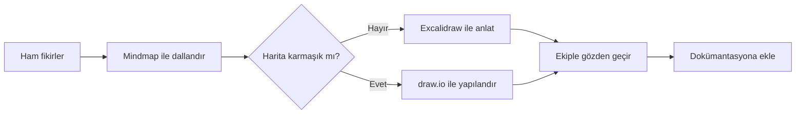

Bir fikir bazen zihnimizde şahane görünür; kâğıda döküldüğünde ise kabloları birbirine karışmış bir sunucu odasına dönüşür. Zihin haritası sistemi, düşünceleri merkezî bir kavramın etrafında dallandırarak bu karmaşayı görünür ve yönetilebilir hâle getirir. Mindmaps yaklaşımı hızlı düşünmek, draw.io düzenli diyagramlar üretmek, Excalidraw ise özgürce karalamak için farklı avantajlar sunar.
``

## Zihin haritasının teorik mantığı

İnsan zihni bilgileri yalnızca doğrusal listeler şeklinde saklamaz. Kavramlar arasında çağrışımlar, hiyerarşiler ve neden-sonuç bağlantıları kurar. Zihin haritası da bu yapıyı taklit eder: merkezde ana konu, çevresinde alt başlıklar ve onların altında ayrıntılar bulunur.

Bir haritanın kullanılabilirliğini basitçe şöyle düşünebiliriz:

$$V = B - (K + G)$$

Burada $V$ haritanın sağladığı zihinsel verim, $B$ görünür bağlantıların faydası, $K$ görsel karmaşıklık ve $G$ gereksiz ayrıntıdır. Daha fazla düğüm eklemek her zaman daha iyi değildir. Amaç, beynin yükünü başka bir yere taşırken yeni bir görsel canavar oluşturmamaktır.

İyi bir sistem üç katmandan oluşabilir:

1. **Yakalama:** Fikirleri sansürlemeden hızla kaydetmek.
2. **Düzenleme:** Benzer fikirleri gruplamak ve ilişkileri tanımlamak.
3. **Sunma:** Haritayı başkalarının anlayabileceği temiz bir çıktıya dönüştürmek.

## Hangi araç ne zaman kullanılmalı?

| Araç | Güçlü olduğu alan | Zayıf olduğu alan | İdeal kullanım |
|---|---|---|---|
| Mindmaps | Hızlı dallanma ve odaklanma | Karmaşık teknik gösterimler | Beyin fırtınası, içerik planı |
| draw.io | Hassas hizalama ve zengin şekiller | Serbest düşünmede yavaş kalabilir | Mimari, süreç ve UML diyagramları |
| Excalidraw | Doğal, samimi ve hızlı çizim | Büyük haritalarda düzen zorlaşabilir | Toplantı, eğitim ve taslak anlatım |


Mindmaps türü araçlarda `Tab` ile alt dal, `Enter` ile kardeş dal açmak düşünce akışını hızlandırır. draw.io, ızgara ve bağlayıcıları sayesinde düzenli sonuç verir. Excalidraw’ın el çizimi görünümü ise taslağın henüz değişebilir olduğunu hissettirir; böylece ekip üyeleri kusursuz görünen bir diyagramı eleştirmekten çekinmez.

## Tek araç yerine iş akışı kurmak

En verimli yöntem, araçları rakip değil aşama olarak görmektir. Örneğin yeni bir yazılım projesinde fikirleri önce Mindmaps veya Excalidraw üzerinde toplayabilir, ardından kalıcı mimariyi draw.io ile çizebilirsin.

Akışı kodla ifade etmek, sistemin tekrar kullanılmasını kolaylaştırır. Aşağıdaki Mermaid şeması fikirden dokümantasyona giden süreci tanımlar:



Bu kod, desteklenen Markdown ortamlarında görsel diyagrama dönüşür. Ayrıca draw.io içindeki Mermaid ekleme özelliğiyle başlangıç şeması olarak kullanılabilir. Böylece kutuları tek tek oluşturmadan yapıyı kodla kurup daha sonra görsel olarak düzenlersin.

## Sürdürülebilir haritalar için kurallar

Her düğümde mümkünse **üç ila beş kelime** kullan. Renkleri dekorasyon için değil, anlam taşımak için seç: kırmızı risk, yeşil tamamlanan iş, mavi bilgi gibi. Çapraz bağlantıları yalnızca gerçekten ilişki varsa ekle; aksi hâlde harita örümcek ağına döner.

Dosya adlarında da ortak bir düzen benimse:

```text
proje-konu-asama-tarih.ext
odeme-sistemi-fikirler-2026-09.excalidraw
odeme-sistemi-mimari-v2.drawio
```

Son olarak her haritaya bir amaç sorusu yaz: “Bu harita hangi kararı vermeme yardım edecek?” Cevap yoksa muhtemelen düşünce üretmiyor, yalnızca renkli kutular biriktiriyorsundur. Doğru araç ve sade kurallarla zihin haritası, fikir mezarlığı değil yaşayan bir düşünme sistemi olur.
